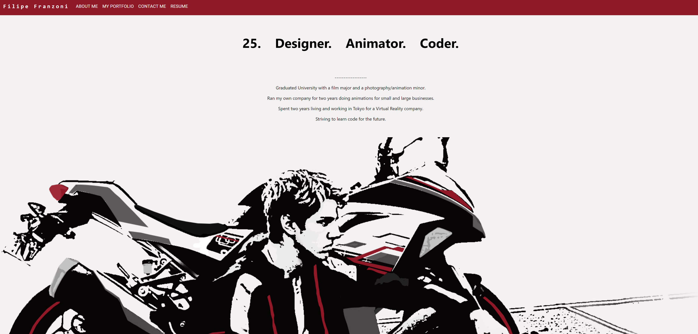

# Module 20 - React Portfolio

## Description

a React based version of the portfolio originally created and shown as a part of this application.

## Table of Contents 

* [Installation](#installation-instructions)

* [Usage](#usage-information)

* [License](#license)

* [Contributing](#contributing-guidelines)

* [Tests](#test-instructions)

* [Questions](#questions)

## Installation Instructions

Please follow these steps when running this application.   1. git clone the repository to your local machine.  2. In terminal, CD into the applications folder.  3. Type and enter 'npm install' to install the dependencies.  4. In the package.json remove the 'homepage' key and value under version otherwise the application will launch incorrectly  5. Type and enter 'npm run build' to build the application.  6. Type and enter 'npm run start' to run the application, the application will be live on your localhost. 

## Usage Information

This project should be used as an example of a react based application as well as used for displaying protfolio pieces in the future.

Sample:

## License

MIT: Permissive free license software. Please visit https://opensource.org/licenses/MIT for more information.
  
## Contributing Guidelines

Flipper5001 was the sole contributer for this project. If you wish to make any contributions, please refer to the questions section for our contact information.

## Test Instructions

npm run test can be used to test the functionality of the website, however tests were not required for this project.

## Questions

Other works can be found on https://github.com/Flipper5001.

If you have any questions or queries, please contact the following email address and we will get back to you as soon as possible.  
placeholder@gmail.com

## Link to site
https://flipper5001.github.io/react-portfolio/